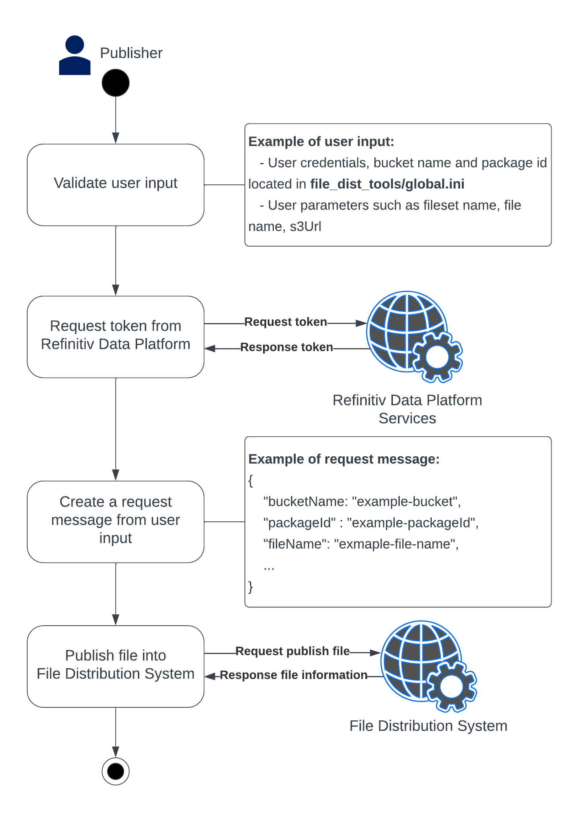

# File Distribution Tools
## _File Publication Tool_ (Python)
This tool is used for File Distribution Publisher publishing a file into File Distribution system. The picture below will show you what this tool does when you execute it on your local machine.



## Prerequisites
File Publication Tool requires [python](https://www.python.org/ftp/python/3.8.8/Python-3.8.8.tgz)  v3.8.8 to run.
Install the python and python libraries and start the run script
1. Install [Python v3.8.8](https://www.python.org/ftp/python/3.8.8/Python-3.8.8.tgz)
2. Run command to install python libraries
```sh
python -m pip install -r requirements.txt
```
3. Prepare your `bucket` and `package` in File Distribution
4. Go to folder name `file_dist_tools` and open file `golbal.ini` and specify all information

    4.1` [RDP]` section specify your RDP credentials (If you don't know information please contact https://developers.refinitiv.com)

    4.2 `[CFS_GLOBAL]` section specify your `bucketName` and `packageId`

|Field name||Description         |Example
|--------|-----------|-------------|-------------|
|bucketName|`Required`|This is a virtual bucket, similar to S3 buckets/folders.|myBucket|
|packageName|`Required`|Package ID that associated with bulk package ID|4fa7-3bea-c36e534c-8105-a203c69568d9|
|contentFrom   |Optional|Earliest date/time of the content within the file.|2022-03-20T11:47:11Z|
|contentTo   |Optional|Latest date/time of the content within the file.|2022-12-25T11:47:11Z|
|attributes   |Optional|Custom file attributes that can be used for query filters if indexed.|name=value,DayOfWeek=4,Product=CFS|

4. Run Program please check Tool Description section


## Tools Description
1. Help command or see `Help Command Description`
```sh
python3 publishFile.py -h 
```

2. Publish a single file
```sh
python publishFile.py -fs <file-set name> -fn <file name> -s3url <s3url>
```

Example:
```sh
python publishFile.py -fs MyFileSetName -fn ExampleFile -s3url https://s3.amazonaws.com/bucket/ExampleFile.csv
```
> **Note:**  This command publish a file with  **required arguments** only, you see more argument and command description in [Help Command Description]

3. Publish a single file with full detail
```sh
python publishFile.py -fs <file-set name> -fn <file name> -s3url <s3url> -a <attributes> -cf <content from> -ct <content to> -af <available from> -at <available to> -fd <file description> -sb <file size in bytes>
```
Example:
```sh
python publishFile.py -fs MyFileSetName -fn ExampleFile -s3url https://s3.amazonaws.com/bucket/ExampleFile.csv -a example=publish,product=publishtools,extra=fulloptions -cf "2022-03-20T11:47:11Z" -ct "2032-03-20T11:47:11Z" -af "2022-03-21T11:47:11Z" -at "2023-03-21T11:47:11Z" -fd "Example Description" -sb 999
```
> **Note:**  This command publish a file with **required and optional arguments**, you see more argument and command description in [Help Command Description]

4. Publish multiple files
```sh
python publishFile.py -c config.ini
```
> **Note:**  **config.ini**, currently this tools support maximum 10 files.

### Help Command Description
|Full Arguments| Arguments|Field name|Type|Description| Example|
|--------|-----------|-------------|-------------|-------------|-------------|
|--filesetname|-fs| filesetName| `Required`|User-friendly name for this file set. Must be unique within the associated Bucket. `Limitation: minLength: 1, maxLength: 256 `|myfilesetname|
|--filename|-fn| fileName| `Required`|Name of the file including the path `Limitation: minLength: 1, maxLength: 256 `|my-file|
|--s3url|-s3url| s3url| `Required`|The AWS Encoded S3 Object URL to the associated File|https://s3.amazonaws.com/bucket/key.json|
|--attributes|-a| attributes | Optional|Custom file attributes that can be used for query filters if indexed.|name=value,DayOfWeek=4,Product=CFS|
|--contentfrom|-cf|contentFrom | Optional|Earliest date/time of the content within the file.|2022-03-20T11:47:11Z|
|--contentto|-ct| contentTo|Optional|Latest date/time of the content within the file.|2032-03-20T11:47:11Z|
|--availablefrom|-af| availableFrom|Optional|The date/time the content becomes available for customers. Future dates are supported.|2022-03-21T11:47:11Z|
|--availableto|-at| availableTo|Optional|The date/time the content will no longer be available for customers.|2023-03-21T11:47:11Z|
|--description|-fd| description| Optional|Description of the file and it's contents.|File Publication from example tools|
|--filesizeinbytes|-sb| fileSizeInBytes|Optional|File size in bytes.|999|
